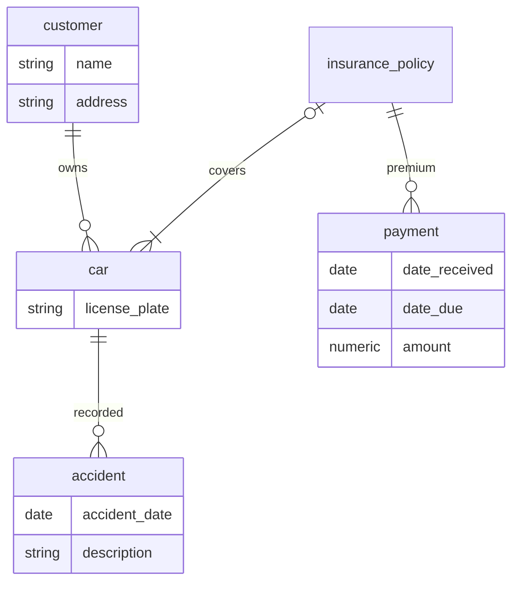
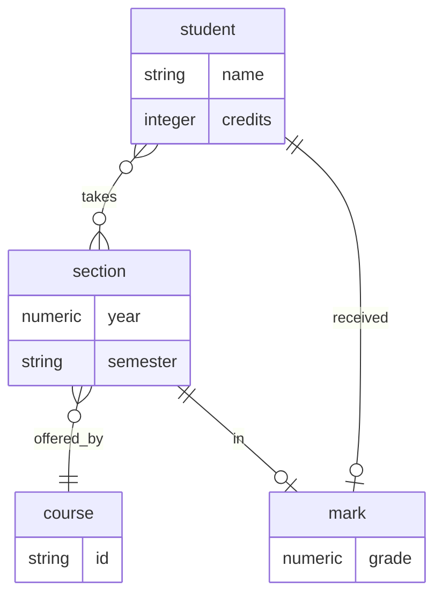

# Written exercises

## 6.1

```mermaid
erDiagram
  customer {
    string name
    string address
  }
  car {
    string license_plate
  }
  accident {
    date accident_date
    string description
  }
  insurance_policy {

  }
  payment {
    date date_received
    date date_due
    numeric amount
  }

  customer ||--o{ car : owns
  car ||--o{ accident : recorded
  insurance_policy |o--|{ car : covers
  insurance_policy ||--o{ payment : premium
```

## 6.2

### a)
`mermaid.js` doesn't allow for ternary relationships in entity-relationship diagrams so I'll take it as an excuse to skip this.

### b)

```mermaid
erDiagram
  student {
    string name
    integer credits
  }
  course {
    string id
  }

  section {
    numeric year
    string semester
  }

  mark {
    numeric grade
  }

  student }o--o{ section : takes
  section }o--|| course : offered_by
  
  student ||--o| mark : received
  section ||--o| mark : in
```
