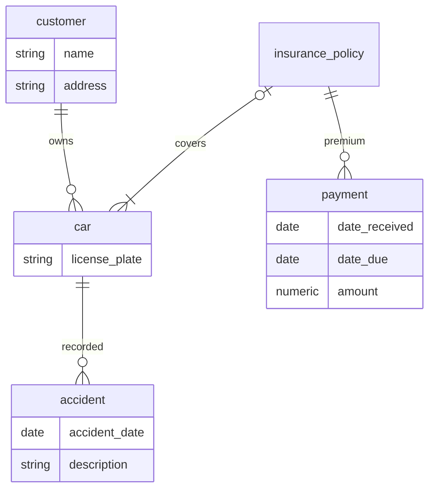

# Written exercises

## 6.1

```mermaid
erDiagram
  customer {
    string name
    string address
  }
  car {
    string license_plate
  }
  accident {
    date accident_date
    string description
  }
  insurance_policy {

  }
  payment {
    date date_received
    date date_due
    numeric amount
  }

  customer ||--o{ car : owns
  car ||--o{ accident : recorded
  insurance_policy |o--|{ car : covers
  insurance_policy ||--o{ payment : premium
```
