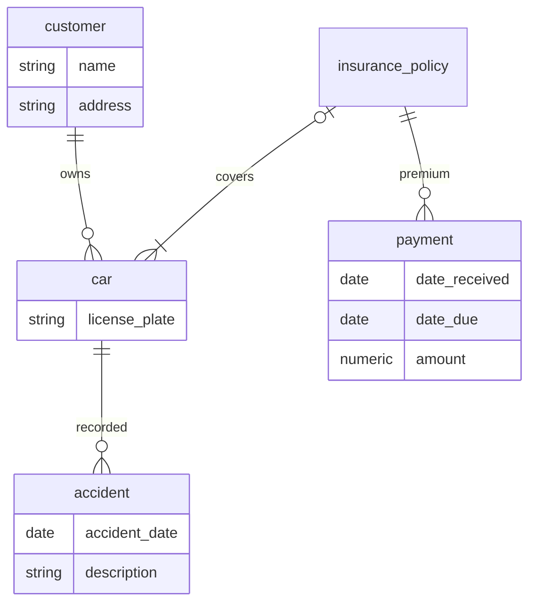
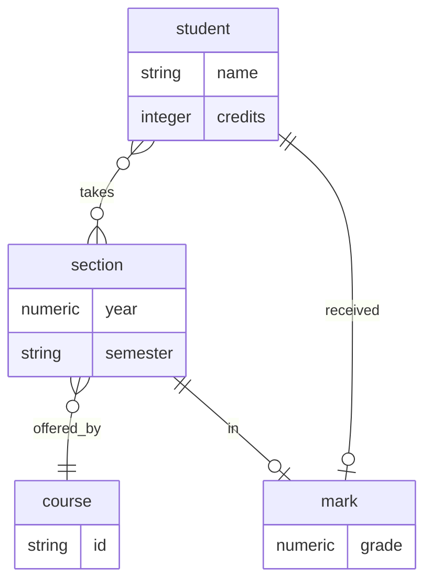
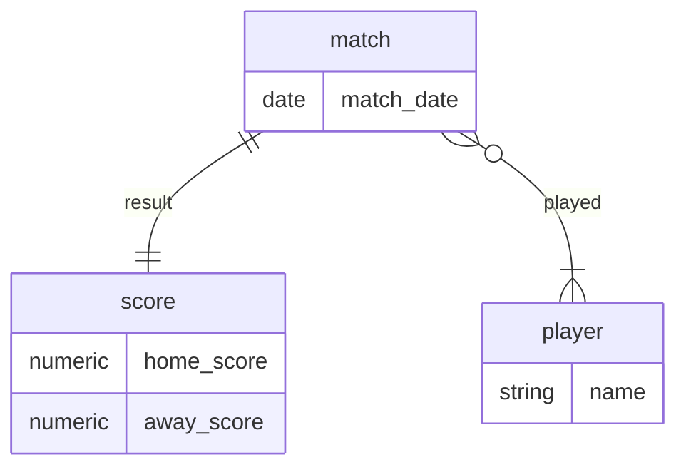

# Written exercises

## 6.1

## 6.2

### a)
`mermaid.js` doesn't allow for ternary relationships in entity-relationship diagrams so I'll take it as an excuse to skip this.

### b)

## 6.3

Can't do derived attributes with mermaid but don't think these matter too much for the substance of this chapter.

## 6.4
The maintenance costs of having to update each occurrence whenever there's a change are higher, and also the possibility of one occurrence not being updated sneaks in, thus causing inconsistencies.
