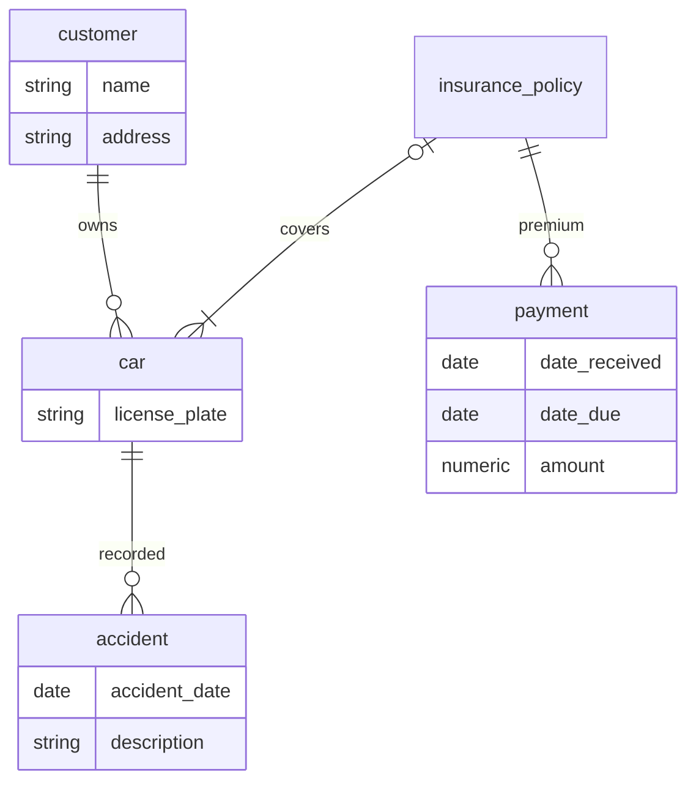
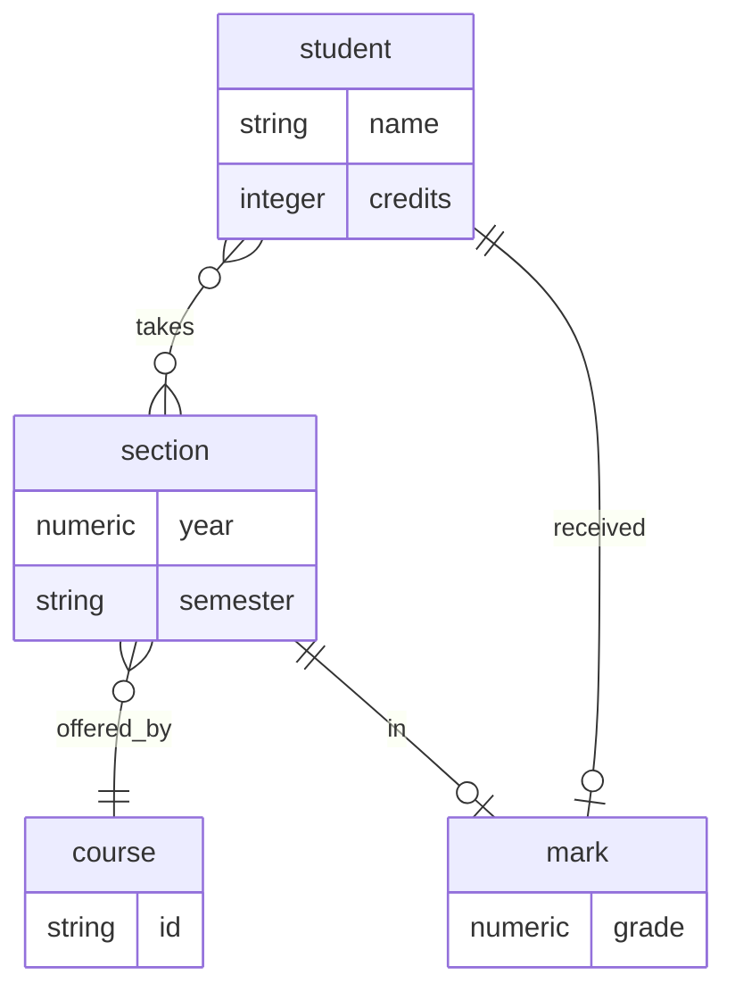
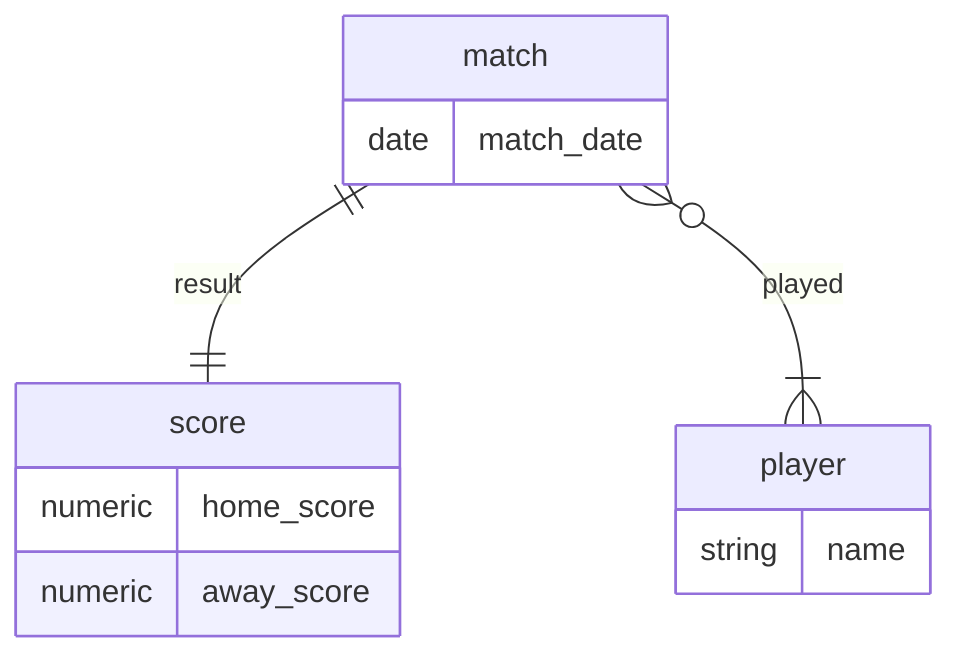

# Written exercises

## 6.1

## 6.2

### a)
`mermaid.js` doesn't allow for ternary relationships in entity-relationship diagrams so I'll take it as an excuse to skip this.

### b)

## 6.3

Can't do derived attributes with mermaid but don't think these matter too much for the substance of this chapter.

## 6.4
The maintenance costs of having to update each occurrence whenever there's a change are higher, and also the possibility of one occurrence not being updated sneaks in, thus causing inconsistencies.

## 6.5
### a)
This means that it can be divided into different sets of entities, whose entites are not related to any of the entities of the other sets. So maybe it could be separated into different schemas or databases

### b)
There is some recursive relation? So a prime use case for recursive [[databases/cte]]s.

## 6.6
I'm not sure I understand this one. The fact that all relationships are many-to-many doesn't mean that there can be null entities?

The answer manual gives
* $E = \{e_1, e_2 \}$
* $A = \{a_1, a_2\}$
* $B = \{b_1\}$
* $C = \{c_1\}$
* $R_A = \{(e_1, a_1), (e_2, a_2) \}$
* $R_B = \{(e_1, b_1) \}$
* $R_C = \{(e_1, c_1) \}$

The answer says that because of $(e_2, a_2)$, there can't be any instance of $A$, $B$, $C$ and $R$ that corresponds to it. But what about 

* $A = \{a_1, a_2\}$
* $B = \{b_1\}$
* $C = \{c_1\}$
* $R = \{(a_1, b_1, c_1), (a_2, \text{null}, \text{null}) \}$

Is it not valid?
==TODO: finish it, but I don't think I understand it==

## 6.7
Then the attributes of the (previously) strong entity would be in two different places. Since that entity exists independently of the (previously) weak entity, it means that we could have one instance of the weak entity with the same information as the strong entity, and whenever we need to update one we must make sure to update both or inconsistencies might ensue.

## 6.8
Yes. The relationship creates a foreign key on `section` to the primary key of `course`. Therefore, `course` is oblivious to the relationship, any `section` can have only one `course` and many `sections` can have the same `course`.

## 6.9
Just as in the one-to-many case, the foreign key is only on one side of the relationship and thus we force the "one" side. The only extra needed constraint is making the foreign key attribute unique, and thus only one tuple in one relation can correspond to another tuple in the other relation.

## 6.10
Since it's many-to-one, the "many" side has a foreign key to the "one" side. However, one entity on the "many" side can have no related entity on the "one" side if the foreign key is nullable. Making the foreign key not nullable ensures that any entity on the "many" side has a corresponding entity in the "one" side and thus the participation is total

## 6.11
### a)
For one-to-many, since the foreign key is in the "many" side, the "one" side os oblivious to the relationship and thus it's impossible for it to force total participation. For the many-to-many case the relationship is reduced to a table, and ensuring that all entities on both sides have a corresponding entity in the other side would need checking three tables (these of the entities, to know which entities exist, and that of the relationship, to check what relationships exist). Thus, this is not possible with simple checks and foreign keys.

I really don't know what the first part of the question has to do with this issue. I don't see how allowing a foregin key to be declared to non-unique values would allow this scenario.

==I think, maybe if foreign keys could point to non-unique attributes, for the many-to-many case, we could have a foreign key on one side to the row in the relationship table? This feels really weird==

### b)
==TODO: Repeat this one==

## 6.12
All attributes of $X$ and $Y$ are inherited by $A$, $B$ and $C$ (that is, they are implicitly present). In case an attribute has the same name in both $X$ and $Y$, it could be prefixed with $X_$ or $Y_$ in $A$, $B$ and $C$
